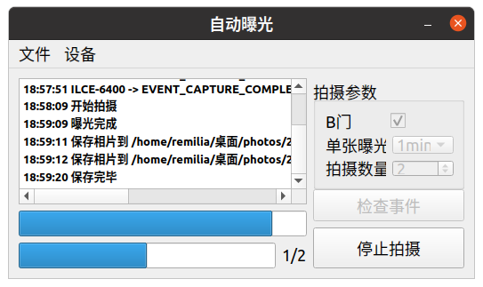

# shutter
使用[PyQt5](https://www.riverbankcomputing.com/software/pyqt/)和[python-gphoto2](https://github.com/jim-easterbrook/python-gphoto2)库开发的Sony A6400相机自动拍摄程序

## 可用的系统
Raspberry Pi 4  
Ubuntu x86-64, armhf & arm64
## 支持的相机
仅测试过Sony A6400，理论上支持除尼康DSLR、 新版佳能EOS DSLR以外的大部分相机
## 使用
点击连接设备后先检查事件，检查事件可以检查是否有未保存的相片
